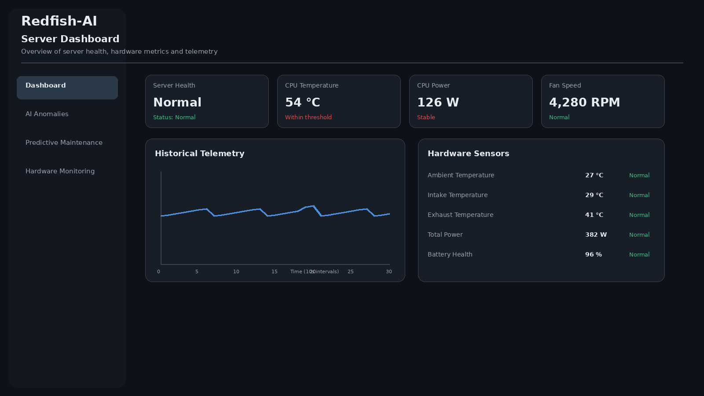
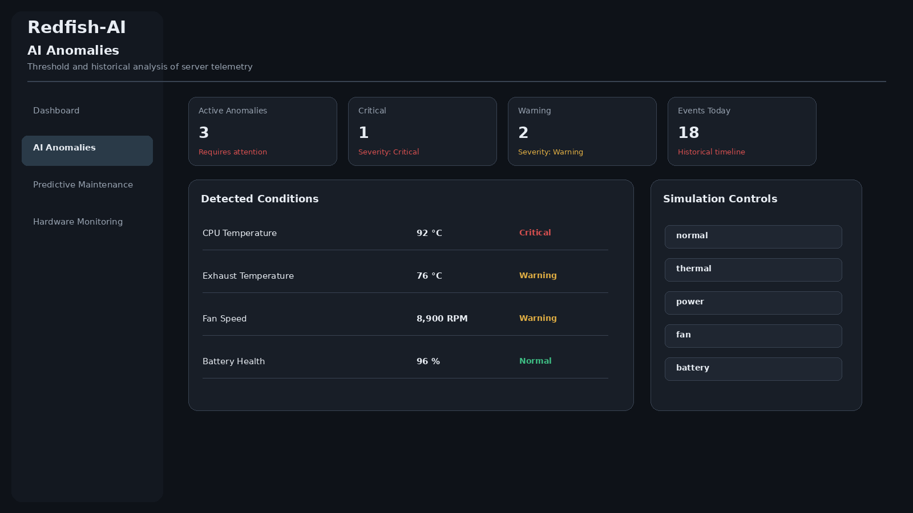
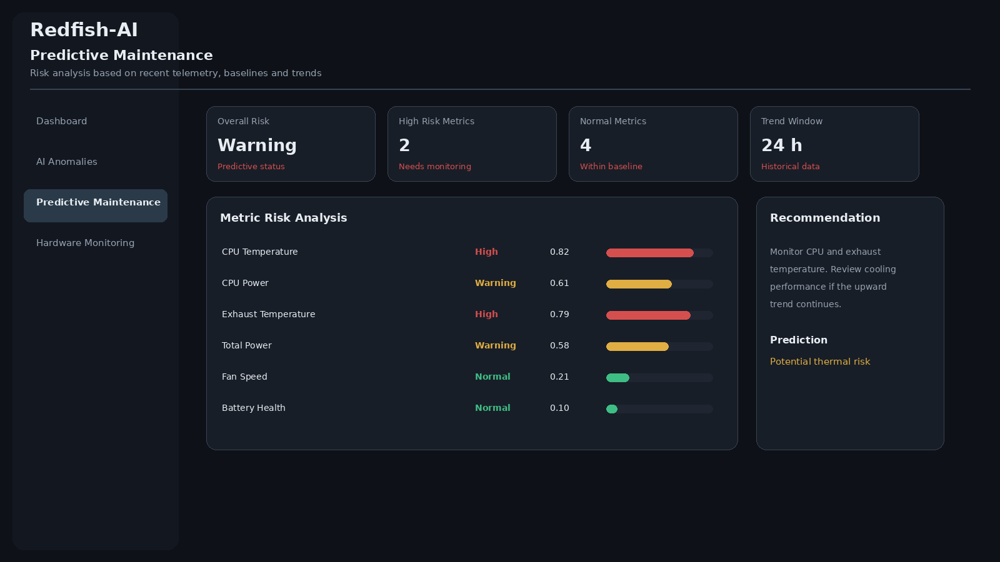
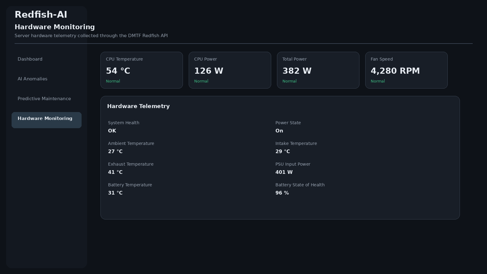

# Redfish-AI

## AI-Powered Intelligent Server Monitoring and Predictive Hardware Maintenance Platform Using DMTF Redfish API

<p align="center">


</p>

<p align="center">
  <strong>Intelligent server monitoring, anomaly detection, hardware health analysis, and predictive maintenance using Redfish telemetry.</strong>
</p>

---

## Overview

Redfish-AI is an intelligent server monitoring and predictive maintenance platform built around the DMTF Redfish API.

The platform collects server hardware telemetry, stores historical measurements, detects abnormal operating conditions, analyzes hardware health, and provides predictive maintenance insights through a modern web dashboard.

The project demonstrates how Redfish-based hardware data can be integrated with statistical analysis, anomaly detection, trend analysis, and predictive maintenance logic to transform raw server telemetry into actionable information.

---

## Project Objectives

The main objectives of Redfish-AI are to:

- Monitor server hardware through the DMTF Redfish API.
- Collect and store hardware telemetry automatically.
- Maintain historical server performance data.
- Detect abnormal hardware conditions.
- Analyze overall server health.
- Identify hardware risk trends.
- Generate predictive maintenance insights.
- Provide maintenance recommendations.
- Visualize server health through an interactive dashboard.
- Demonstrate AI-oriented techniques for infrastructure monitoring.

---

## System Architecture

```text
                     +-------------------------+
                     |   Redfish Mockup Server |
                     |          :5000          |
                     +------------+------------+
                                  |
                                  | DMTF Redfish API
                                  v
                     +-------------------------+
                     |     FastAPI Backend     |
                     |          :8000          |
                     +------------+------------+
                                  |
                +-----------------+-----------------+
                |                 |                 |
                v                 v                 v
         Telemetry          Anomaly Detection   Health Analysis
         Collection
                |                 |                 |
                +-----------------+-----------------+
                                  |
                                  v
                     +-------------------------+
                     |      SQLite Storage     |
                     |     Historical Data     |
                     +------------+------------+
                                  |
                                  v
                     +-------------------------+
                     | Predictive Maintenance  |
                     |      Risk Analysis      |
                     +------------+------------+
                                  |
                                  v
                     +-------------------------+
                     |     React Dashboard     |
                     |          :5173          |
                     +-------------------------+
```

---

## Screenshots

The following generated dashboard visuals represent the documented Redfish-AI interface and its major modules.

### Dashboard

The main dashboard provides an overview of server health, hardware metrics, CPU information, sensor data, and historical telemetry.

<p align="center">
  
</p>

### AI Anomalies

The AI Anomalies module displays detected abnormal conditions, severity information, anomaly statistics, event data, and simulation controls.

<p align="center">
  
</p>

### Predictive Maintenance

The Predictive Maintenance module presents metric-level risk analysis, trends, risk scores, predictions, and maintenance recommendations.

<p align="center">
  
</p>

### Hardware Monitoring

The Hardware Monitoring module presents server hardware telemetry collected through the DMTF Redfish API.

<p align="center">
  
</p>

---

## Key Features

### Real-Time Redfish Hardware Monitoring

The platform retrieves server hardware information through the DMTF Redfish API, including:

- Server system information
- CPU information
- CPU temperature
- CPU power consumption
- Fan speed
- System power consumption
- Ambient temperature
- Intake temperature
- Exhaust temperature
- Power supply measurements
- Battery temperature
- Battery state of health
- System health
- Power state

### Automated Telemetry Collection

The backend automatically collects server telemetry at a configurable interval.

The current monitoring service collects telemetry every 10 seconds and stores the measurements in SQLite.

This historical dataset is used for anomaly detection and predictive maintenance analysis.

### Historical Telemetry Storage

Telemetry measurements are stored using SQLite.

The stored information includes:

- Timestamp
- System ID
- CPU ID
- CPU temperature
- CPU power
- Fan speed
- System health
- Power state
- Ambient temperature
- Intake temperature
- Exhaust temperature
- Total power
- PSU input power
- Battery temperature
- Battery state of health

### AI-Based Anomaly Detection

The anomaly detection system combines configured hardware thresholds with statistical analysis.

It detects abnormal behavior in metrics such as:

- CPU temperature
- CPU power
- Fan speed
- Exhaust temperature
- Total power
- Battery health

Historical measurements are analyzed using Z-score analysis to identify values that significantly differ from historical behavior.

Each detected anomaly receives an anomaly score and severity classification.

### Server Health Analysis

The health analysis layer evaluates the latest server telemetry and determines the current server health state.

Possible states include:

| Status | Description |
|---|---|
| Normal | Server operating within expected conditions |
| Warning | Potential abnormal condition detected |
| Critical | Serious hardware condition detected |
| Unknown | Health information unavailable |

### Predictive Maintenance

The predictive maintenance engine analyzes historical telemetry to identify potential hardware risks.

For each supported metric, the system evaluates:

- Current value
- Recent average
- Baseline average
- Historical standard deviation
- Recent change
- Trend
- Risk score
- Risk level
- Prediction
- Maintenance recommendation

Risk levels include:

- Normal
- Warning
- High
- Critical

The objective is to identify deteriorating hardware conditions before they become serious failures.

### Hardware Simulation

A telemetry simulation layer is included to demonstrate abnormal hardware conditions without requiring physical server failures.

| Mode | Simulated Condition |
|---|---|
| `normal` | Normal server operation |
| `thermal` | Increased CPU and exhaust temperature |
| `power` | Increased CPU and total power consumption |
| `fan` | High fan speed |
| `battery` | Reduced battery state of health |

### Interactive Dashboard

The React dashboard provides a centralized interface for monitoring server health.

It includes:

- Overall server health
- Hardware metrics
- CPU information
- Sensor information
- Historical telemetry
- Active anomaly conditions
- Anomaly statistics
- Anomaly timeline
- Predictive maintenance results
- Risk scores
- Maintenance recommendations
- Simulation controls

---

## Technology Stack

### Backend

- Python 3.10+
- FastAPI
- Requests
- Pydantic
- Python-dotenv
- SQLite
- Uvicorn

### Frontend

- React
- JavaScript
- Vite
- CSS

### Server Management

- DMTF Redfish API
- DMTF Redfish Mockup Server

### Data Analysis

- Statistical anomaly detection
- Z-score analysis
- Threshold-based detection
- Trend analysis
- Risk scoring
- Predictive maintenance logic

---

## Project Structure

```text
redfish-ai/
│
├── .gitignore
├── README.md
│
├── docs/
│   └── screenshots/
│       ├── dashboard.png
│       ├── anomalies.png
│       ├── predictive-maintenance.png
│       └── hardware-monitoring.png
│
├── backend/
│   ├── .env
│   ├── requirements.txt
│   │
│   └── app/
│       ├── __init__.py
│       ├── config.py
│       ├── main.py
│       ├── models.py
│       ├── redfish_client.py
│       ├── routes.py
│       ├── telemetry.py
│       ├── monitoring.py
│       ├── database.py
│       ├── anomaly.py
│       ├── simulator.py
│       ├── health.py
│       ├── predictive.py
│       └── state.py
│
└── frontend/
    ├── package.json
    ├── package-lock.json
    ├── index.html
    ├── public/
    └── src/
        ├── App.jsx
        ├── App.css
        ├── main.jsx
        └── assets/
```

---

## Requirements

Before running the project, install:

- Python 3.10+
- Node.js
- npm
- Git
- DMTF Redfish Mockup Server

Docker is not required.

---

## Installation

### Clone the Repository

```bash
git clone https://github.com/rvitmonisha/redfish-ai.git
cd redfish-ai
```

### Backend Setup

```bash
cd backend
python -m venv venv
```

Activate the virtual environment on Windows:

```bash
venv\Scripts\activate
```

Install dependencies:

```bash
pip install -r requirements.txt
```

### Backend Configuration

Create:

```text
backend/.env
```

Add:

```env
REDFISH_HOST=127.0.0.1:5000
REDFISH_USERNAME=
REDFISH_PASSWORD=
REDFISH_VERIFY_SSL=false
REDFISH_SCHEME=http
```

The backend uses this configuration to connect to the local Redfish Mockup Server.

Do not commit `.env` files containing credentials to GitHub.

### Start the Redfish Mockup Server

Start the DMTF Redfish Mockup Server.

The server should be available at:

```text
http://127.0.0.1:5000
```

The Redfish service root should be:

```text
http://127.0.0.1:5000/redfish/v1
```

### Start the Backend

From the `backend` directory:

```bash
uvicorn app.main:app --reload --port 8000
```

The FastAPI backend will be available at:

```text
http://127.0.0.1:8000
```

FastAPI documentation:

```text
http://127.0.0.1:8000/docs
```

### Frontend Setup

Open a new terminal:

```bash
cd frontend
npm install
npm run dev
```

The frontend will be available at:

```text
http://localhost:5173
```

---

## API Endpoints

### Redfish

```text
GET /api/redfish/root
GET /api/redfish/systems
GET /api/redfish/chassis
GET /api/redfish/managers
```

### Telemetry

```text
GET /api/redfish/telemetry
POST /api/redfish/monitoring/collect
GET /api/redfish/monitoring/history
```

### Monitoring

```text
GET /api/redfish/monitoring/anomalies
GET /api/redfish/monitoring/health
GET /api/redfish/monitoring/predictive
```

### Simulation

```text
POST /api/redfish/monitoring/simulation
```

Example request:

```json
{
  "mode": "thermal"
}
```

Available modes:

```text
normal
thermal
power
fan
battery
```

---

## Predictive Maintenance Workflow

```text
Redfish Telemetry
       |
       v
Historical Storage
       |
       v
Metric Extraction
       |
       v
Recent Measurements
       |
       v
Trend Calculation
       |
       v
Historical Baseline
       |
       v
Risk Score
       |
       v
Prediction
       |
       v
Maintenance Recommendation
```

The system currently analyzes:

- CPU Temperature
- CPU Power
- Exhaust Temperature
- Total Power
- Fan Speed
- Battery Health

---

## Anomaly Detection Workflow

```text
Latest Telemetry
       |
       +----------------> Threshold Detection
       |
       +----------------> Historical Analysis
                                |
                                v
                             Z-Score
                                |
                                v
                          Anomaly Score
                                |
                                v
                       Severity Classification
```

The system identifies both direct threshold violations and unusual behavior compared with historical measurements.

---

## Dashboard Modules

### Dashboard

Provides an overview of:

- Server health
- Hardware metrics
- CPU information
- Historical telemetry
- Active conditions
- Sensor information

### AI Anomalies

Provides:

- Active anomaly conditions
- Anomaly statistics
- Severity distribution
- Event timeline
- Detailed anomaly records
- Simulation controls

### Predictive Maintenance

Provides:

- Predictive status
- Risk summary
- Metric-level risk scores
- Historical averages
- Trends
- Predictions
- Maintenance recommendations

---

## Data Flow

```text
Redfish API
     |
     v
RedfishClient
     |
     v
TelemetryCollector
     |
     v
MonitoringService
     |
     +---------------> SQLite
     |
     +---------------> AnomalyDetector
     |
     +---------------> ServerHealthAnalyzer
     |
     +---------------> PredictiveMaintenance
                              |
                              v
                         FastAPI API
                              |
                              v
                       React Dashboard
```

---

## Simulation Demonstration

The simulation system demonstrates how the monitoring and predictive maintenance components respond to abnormal hardware conditions.

### Thermal Simulation

```text
Mode: thermal
```

Simulates:

- High CPU temperature
- High exhaust temperature

### Power Simulation

```text
Mode: power
```

Simulates:

- High CPU power
- High total server power

### Fan Simulation

```text
Mode: fan
```

Simulates:

- High fan speed

### Battery Simulation

```text
Mode: battery
```

Simulates:

- Reduced battery state of health

After enabling a simulation mode, telemetry is collected and stored so that the anomaly detection and predictive maintenance components can analyze the simulated condition.

---

## Security Considerations

The project uses environment variables for Redfish configuration.

Sensitive configuration should be stored in:

```text
backend/.env
```

The `.env` file should not be committed to GitHub.

Production deployments should additionally consider:

- HTTPS
- Secure Redfish credentials
- Authentication and authorization
- Secret management
- Network isolation
- API rate limiting
- Secure database configuration

---

## Future Enhancements

Potential future improvements include:

- Machine learning-based failure prediction
- Advanced time-series forecasting
- Additional Redfish resources
- Storage and drive health monitoring
- Memory health monitoring
- PCIe device monitoring
- GPU monitoring
- Network interface monitoring
- Automated alert notifications
- Email and messaging alerts
- Prometheus integration
- Grafana integration
- PostgreSQL support
- Multi-server monitoring
- User authentication
- Role-based access control
- Production deployment
- Containerized deployment

---

## Project Goals

The primary goals of Redfish-AI are to:

1. Learn and demonstrate the DMTF Redfish API.
2. Build a complete server telemetry collection pipeline.
3. Store and analyze historical hardware data.
4. Detect abnormal server conditions.
5. Analyze hardware health.
6. Develop predictive maintenance capabilities.
7. Visualize server health through a professional dashboard.
8. Demonstrate how AI-oriented techniques can be applied to infrastructure monitoring.

---

## Disclaimer

Redfish-AI is a learning and demonstration project designed around Redfish-based server monitoring and predictive maintenance concepts.

The predictive maintenance component provides analytical indicators based on available telemetry and configured thresholds. It should not be treated as a replacement for manufacturer-specific hardware diagnostics or operational maintenance procedures.

---

## Author

**Monisha**

GitHub:

https://github.com/rvitmonisha

Project Repository:

https://github.com/rvitmonisha/redfish-ai

---

## License

This project is currently provided without a specified open-source license.
